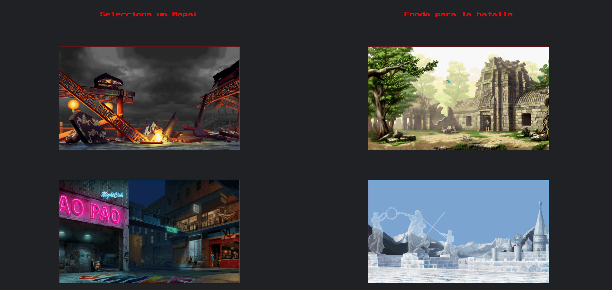
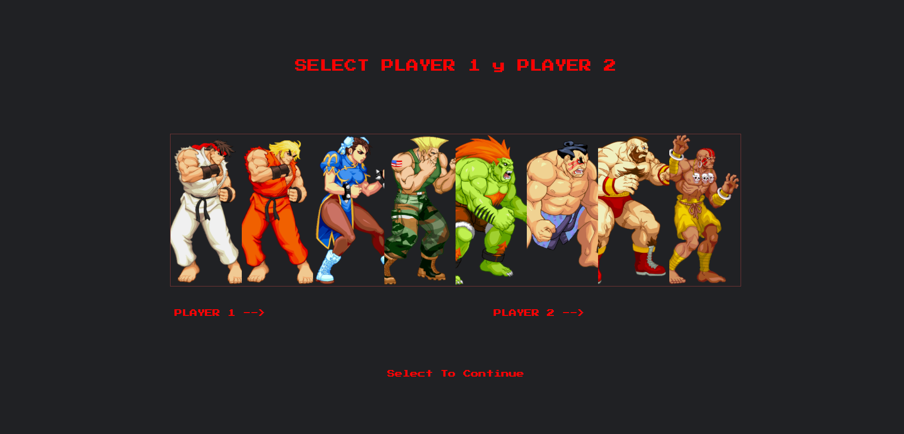
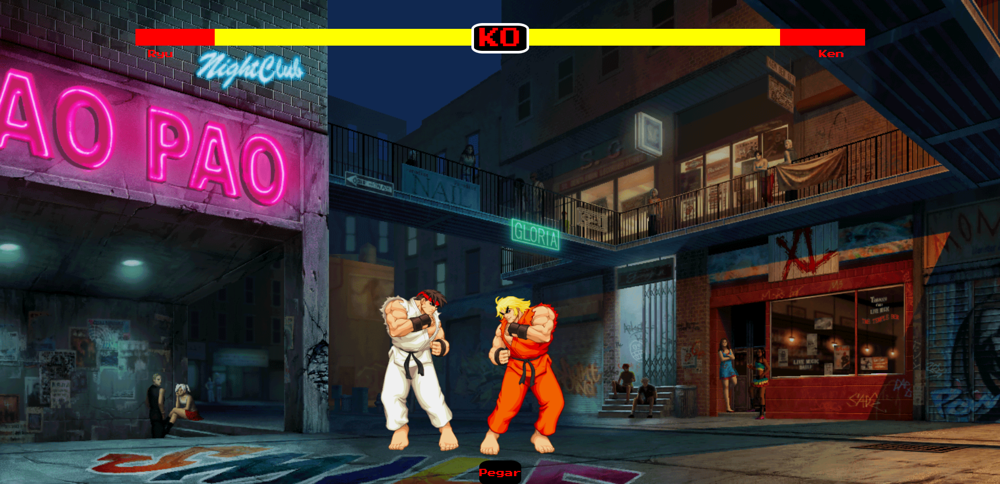

# ProyectoStreetFighterJS

Proyecto creado utilizando HTML5, CSS3 y JS Vanilla.

Puedes previsualizar el Proyecto haciendo click [aqui](https://andreumartinezg.github.io/StreetFighterJS/)

## 0. Indice:

  [1. Introduccion:](#1-introducción) 
  [2. Como usar:](#2-como-usar) 
  [3. Descripción del Proyecto:](#3-descripción-del-proyecto) 
  [4. Diseño:](#4-diseño) 
  [5. Futuras Funcionalidades:](#5-futuras-funcionalidades) 
  [6. Herramientas Utilizadas:](#6herramientas-utilizadas)

## 1. Introducción.

En este proyecto he desarrollado un juego basandome en la tematica de Street Fighter.

En el podemos encontrar varias pantallas creadas sobre un unico archivo index.html y usando JavaScript Vanilla.

Tenemos varias pantallas de seleccion, empezando por la que nos permite seleccionar el mapa que se va a visualizar en la batalla:

En la siguiente pantalla se nos permite seleccionar los campeones que vamos a utilizar durante la batalla:

 

Cuenta tambien con una pantalla para la batalla con el mapa y los personajes seleccionados:

## 2. Como Usar.

- Las Funcionalidades son bastantes basicas, seleccionamos mapa y luchadores para la batalla, en el transcurso de la batalla unicamente se podra pulsar sobre el boton pegar para lanzar las animaciones y los daños sobre los luchadores.

## 3. Descripción del proyecto.

- Este ha sido un proyecto muy complicado ya que se ha desarrollado un "Juego" con Java Script Vanilla, con todas las dificultades que conlleva.

- Me he centrado sobre todo en conseguir un buen diseño que se aproxime lo mayor posible al juego.

## 4. Diseño.

- Me he inspirado en la saga de juegos Street ya que me resulta muy visual, añadiendo los sonidos y imagenes del mismo.

## 5. Futuras funcionalidades.

- Me habria gustado poder añadir funcionalidades a las teclas como en el juego real, introduciendo mas jugabilidad.

- Tambien tengo pensado añadir sprites de todos los luchadores para acompañar a la jugabilidad añadida en futuras funcionalidades.

## 6.Herramientas Utilizadas:

-El proyecto se ha realizado esencialmente con la herramienta VisualStudio Code.

-Herramienta de Live Server para ir viendo el proceso de construcción.

-GitHub para el almacenamiento y el control de lo realizado en el proyecto.

[Subir](#top)

